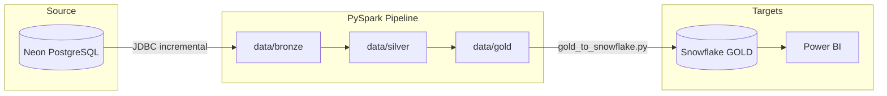

# Payments Reconciliation Pipeline

A medallion-style data pipeline that ingests payment data from **Neon PostgreSQL**, transforms it with **PySpark**, builds a **gold star schema** for analytics, and loads results into **Snowflake** for BI tools like Power BI.

## Overview

| Layer | Engine | Purpose |
|-------|--------|---------|
| **Bronze** | PySpark | Incremental JDBC extract from Neon → raw Parquet |
| **Silver** | PySpark | Standardize, dedupe, reconcile, validate |
| **Gold** | PySpark | Fact & dimension tables (star schema) |
| **Load** | Python + Snowflake connector | Upload gold Parquet → Snowflake |

**Source entities:** `transactions`, `refunds`, `chargebacks`

## Architecture



### Bronze

- Reads from Neon via JDBC (`BronzeLoader`)
- Supports **incremental loads** using watermarks per entity
- Writes Snappy-compressed Parquet under `data/bronze/{entity}/`
- Emits audit CSVs to `reports/audit/`

### Silver

- **Standardization** — date/amount/type normalization
- **Deduplication** — primary-key based dedupe per entity
- **Reconciliation** — joins transactions with refund/chargeback aggregates
- **Data quality** — validation checks before gold layer
- Outputs: `transactions`, `refunds`, `chargebacks`, `reconciliation_base`

### Gold

- Builds a **star schema** (6 dimensions + 3 facts)
- Reads silver Parquet with PySpark (no pandas in the pipeline)
- Writes flat Parquet files: `data/gold/*.parquet`

### Snowflake Load

- Separate script loads gold Parquet into Snowflake tables
- Maps parquet columns to DDL-defined schema
- Uses staging tables for fact loads (workaround for clustered-table COPY issues)

## Gold Schema

### Dimensions

| Table | Description |
|-------|-------------|
| `dim_date` | Calendar / time intelligence |
| `dim_merchant` | Merchant lookup |
| `dim_currency` | Currency codes |
| `dim_transaction_status` | Transaction status categories |
| `dim_refund_reason` | Refund reason codes |
| `dim_chargeback_reason` | Chargeback reason codes |

### Facts

| Table | Grain | Description |
|-------|-------|-------------|
| `fact_transaction` | 1 row / transaction | Revenue, refunds, chargebacks, risk flags |
| `fact_refund` | 1 row / refund | Refund-level detail |
| `fact_chargeback` | 1 row / chargeback | Chargeback-level detail |

DDL: `sql/snowflake_gold_ddl.sql`

## Project Structure

```
Git_project2/
├── configs/
│   └── app_config.yaml          # Paths, incremental settings, entities
├── data/
│   ├── bronze/                  # Raw Parquet (by entity)
│   ├── silver/                  # Cleaned Parquet
│   └── gold/                    # Star schema Parquet (*.parquet)
├── docs/
│   └── gold_layer_powerbi_guide.md
├── logs/
│   ├── pipeline.log
│   └── spark-events/
├── reports/
│   ├── audit/                   # Bronze load audit CSVs
│   ├── pipeline_metrics/
│   └── watermarks/              # Incremental watermark state
├── sql/
│   └── snowflake_gold_ddl.sql   # Snowflake table definitions
├── src/
│   ├── main.py                  # Full pipeline entry point
│   ├── ingestion/
│   │   └── bronze_load.py       # Neon → bronze
│   ├── transformation/
│   │   ├── silver_transform.py  # Bronze → silver
│   │   ├── gold_transform.py    # Silver → gold (PySpark)
│   │   ├── standardization.py
│   │   ├── deduplication.py
│   │   └── data_quality.py
│   ├── reconciliation/
│   │   └── base_reconciliation.py
│   ├── load/
│   │   └── gold_to_snowflake.py # Gold → Snowflake
│   ├── audit/
│   │   ├── audit_logger.py
│   │   └── metadata_manager.py
│   └── utils/
│       ├── spark_session.py     # Spark session (Windows-safe)
│       └── config_reader.py
├── .env.example                 # Credential template
├── requirements.txt
└── README.md
```

## Prerequisites

- **Python 3.12+**
- **Java 11+** (required by Spark)
- **Neon PostgreSQL** database with payment tables
- **Snowflake** account (for gold load step)
- Windows: project includes `.hadoop/` workaround for Spark native libs

## Setup

### 1. Clone and install dependencies

```powershell
cd Git_project2
python -m venv .venv
.\.venv\Scripts\Activate.ps1
pip install -r requirements.txt
```

### 2. Configure environment

Copy the template and fill in your credentials:

```powershell
copy .env.example .env
```

**Neon (source):**

```env
NEON_HOST=your-host.neon.tech
NEON_PORT=5432
NEON_DATABASE=neondb
NEON_USER=your_user
NEON_PASSWORD=your_password
NEON_SSLMODE=require
```

**Snowflake (gold load):**

```env
SNOWFLAKE_ACCOUNT=your_account.region.cloud
SNOWFLAKE_USER=your_user
SNOWFLAKE_PASSWORD=your_password
SNOWFLAKE_WAREHOUSE=COMPUTE_WH
SNOWFLAKE_DATABASE=PAYMENTS_DB
SNOWFLAKE_SCHEMA=GOLD
SNOWFLAKE_ROLE=ACCOUNTADMIN
```

> **Security:** Never commit `.env` to version control. Add `.env` to `.gitignore`.

### 3. Pipeline config

Edit `configs/app_config.yaml` for storage paths and incremental entity settings if needed.

## Running the Pipeline

All pipeline commands should be run from the `src/` directory (or with `PYTHONPATH` set to `src/`).

### Full pipeline (Bronze → Silver → Gold)

```powershell
cd src
python main.py
```

This runs:

1. Directory setup
2. Bronze incremental load from Neon
3. Silver transformations + reconciliation + DQ
4. Gold star schema build
5. Pipeline metrics and audit logging

Spark UI is available at `http://localhost:4040` after the run (press Enter to exit when `KEEP_SPARK_UI_OPEN=true`).

### Individual layers

```powershell
cd src

# Gold only (requires silver data)
python -m transformation.gold_transform

# Silver only (requires bronze data)
python -m transformation.silver_transform
```

## Snowflake Load

### 1. Create tables

Run `sql/snowflake_gold_ddl.sql` in a Snowflake worksheet to create `PAYMENTS_DB.GOLD` schema and tables.

### 2. Verify configuration

```powershell
python src\load\gold_to_snowflake.py --check-env
```

### 3. Load gold Parquet files

```powershell
python src\load\gold_to_snowflake.py
```

Expected output (example):

```
=== GOLD -> Snowflake Loader ===
Connected to: ('PAYMENTS_DB', 'GOLD')
  [OK] dim_date: 24 rows loaded
  ...
  [OK] fact_transaction: 40 rows loaded (staging)
=== Done. Total rows across gold tables: 137 ===
```

### Verify in Snowflake

```sql
USE DATABASE PAYMENTS_DB;
USE SCHEMA GOLD;

SELECT 'fact_transaction' AS tbl, COUNT(*) AS rows FROM fact_transaction
UNION ALL SELECT 'fact_refund', COUNT(*) FROM fact_refund
UNION ALL SELECT 'fact_chargeback', COUNT(*) FROM fact_chargeback;
```

## Configuration Reference

### `configs/app_config.yaml`

| Key | Default | Description |
|-----|---------|-------------|
| `storage.bronze_path` | `data/bronze` | Bronze Parquet output |
| `storage.silver_path` | `data/silver` | Silver Parquet output |
| `storage.gold_path` | `data/gold` | Gold Parquet output |
| `incremental.enabled` | `true` | Enable watermark-based incremental bronze loads |
| `incremental.watermark_path` | `reports/watermarks/bronze_watermarks.json` | Watermark state file |

### Environment variables

| Variable | Required | Description |
|----------|----------|-------------|
| `NEON_*` | Bronze load | Neon PostgreSQL connection |
| `SNOWFLAKE_*` | Gold load | Snowflake connection |
| `KEEP_SPARK_UI_OPEN` | No | Keep Spark UI alive after pipeline (`true`/`false`) |

## Outputs & Artifacts

| Path | Description |
|------|-------------|
| `data/bronze/{entity}/` | Raw incremental Parquet |
| `data/silver/{entity}/` | Cleaned entity Parquet |
| `data/gold/*.parquet` | Flat gold table files |
| `reports/audit/bronze_load_audit.csv` | Full bronze audit history |
| `reports/audit/bronze_load_last_run.csv` | Latest bronze run audit |
| `reports/pipeline_metrics/metrics.csv` | Pipeline run metrics |
| `logs/pipeline.log` | Pipeline log |
| `logs/spark-events/` | Spark event logs |

## Power BI

See `docs/gold_layer_powerbi_guide.md` for recommended dashboard pages, DAX measures, and Snowflake → Power BI connection steps.

**Tip:** Mark `dim_date` as the date table in Power BI for time intelligence.

## Windows Notes

- Spark session is configured for Windows (`HADOOP_HOME`, `PYSPARK_PYTHON`, Arrow disabled)
- Gold layer uses pure Spark SQL (no `createDataFrame` with Python `date` objects) to avoid worker crashes
- Gold writes use `coalesce(1)` + single-file Parquet for Snowflake compatibility

## Tech Stack

| Component | Technology |
|-----------|------------|
| Compute | Apache Spark 3.5 (PySpark) |
| Source DB | Neon PostgreSQL |
| Warehouse | Snowflake |
| Storage format | Parquet (Snappy) |
| Config | YAML + dotenv |
| BI target | Power BI (via Snowflake) |

## Troubleshooting

| Issue | Fix |
|-------|-----|
| `Missing Neon environment values` | Fill `NEON_*` vars in `.env` |
| `Missing required Snowflake env vars` | Fill `SNOWFLAKE_ACCOUNT`, `USER`, `PASSWORD`, `WAREHOUSE` in `.env` |
| `ModuleNotFoundError: utils` | Run from `src/` or set `PYTHONPATH=src` |
| Spark worker crash on Windows | Ensure you use the project `spark_session.py`; gold layer must stay PySpark-native |
| Snowflake `invalid identifier` on load | Re-run loader — column mapping is handled in `gold_to_snowflake.py` |
| `[WARN] fact_transaction.gross_amount` | One source transaction has a null `amount`; gold coalesces to `0.0` and sets `risk_category=INVALID_AMOUNT`. Check `reports/data_quality/dq_report.json` for `transaction_amount_not_null` |

## License

Internal / educational project. Add a license file if distributing publicly.